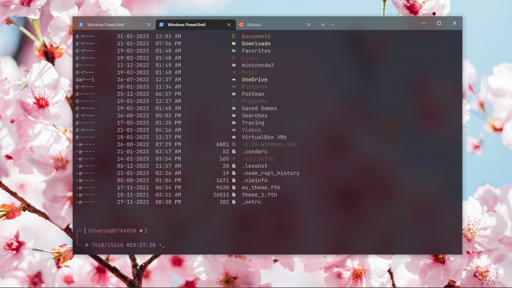
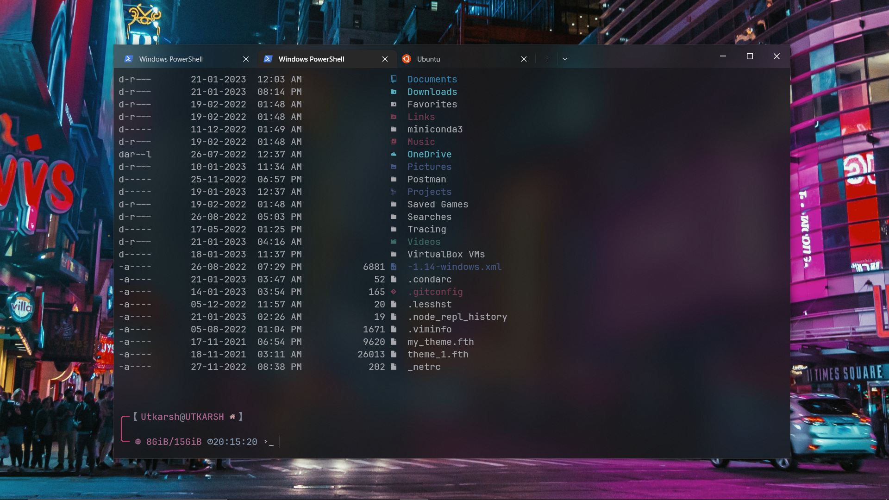

# 🔥Windows Terminal Better
Make windows terminal better using spaceship and winwal(pywal).

# Easy to follow steps
* ## Install `>_`Terminal
  1. Install terminal for windows form *Microsoft Store* or type `bash` in cmd/powershell and head over to installing.

  2. Once done, open the terminal. If it shows any error, try opening powershell once.
  3. Click on the '`∨`' from title bar and go to *Settings*.
  4. Select **Appearance** section and turn on *Use acrylic material in the tab row*.
  5. Then select **Defaults** section and click **Appearance**.
  6. Change *Color Scheme* as your liking. I'm using *One Half Dark*.
  7. Reduce *Background opacity* to about 75-80. Turn on *Enable acrylic material*. Oprionally you can also hide *Scrollbar visibility*.
  8. Finally click *Save* and relaunch the terminal to see all changes.

* ## Install 🔠Nerd Fonts
  1. Headover to [Nerd Fonts](https://www.nerdfonts.com/) downloads page.

  2. Find a font of your liking and download. I'm using JetBrainsMono Nerd Font.
  3. Unzip, select all, right click and click install for all users.
  4. Go to terminal settings and under **Defaults** section, select **Appearance**.
  5. Change *Font face* to the newly installed nerd fonts.

* ## Install 📁Terminal-Icons
  Run this command in the powershell terminal to install *Terminal-Icons*.
    ```powershell
    Install-Module -Name Terminal-Icons -Repository PSGallery
    ```
   Then run this command to start using *Terminal-Icons*.
    ```powershell
    Import-Module -Name Terminal-Icons
    ```
  Checkout [Terminal-Icons](https://github.com/devblackops/Terminal-Icons).

* ## Install 🚀Starship
  1. Go to [starship github](https://github.com/starship/starship/releases). Under **Assets** of the latest release, click on *Show all assets*. Download the one suitable for your system.  
  Alternatively, you can install it using any package package manager like [Chocolatey](https://chocolatey.org/install), [Scoop](https://scoop.sh/) etc.  
  Checkout [Starship installation](https://starship.rs/guide/#%F0%9F%9A%80-installation) page for more info.

  2. Check if starship installed correctly by typing `starship` in terminal powershell. You should see some usage and commands related to starship.
  3. Go to your home folder by running this `cd ~` command in powershell.Now run `nodepad $profile`. A file will open in nodepad. Paste this line in it and save.  
      ```powershell
      Invoke-Expression (&starship init powershell)
      ```
  4. Restart the terminal to see changes in effect.

* ## Install 🖼️winwal
  1. Open terminal powershell and type python. If this opens microsoft store, install python.
  
  2. Restart terminal and run this command
      ```
      pip install pywal colorthief colorz haishoku
      ```

* ## ⚙️Configuration
  1. Go to home directory by running `mkdir ~\.config`.
  You may enconter something like  
  *'An item with the specified name C:\Users\Utkarsh\.config already exists.'*  
  Its just saying the folder already exists. So, you can ignore and continue.

  2. Now run `cd ~\.config` and then type `explorer .` and hit enter.This will open a **.config** folder.
  3. Download and paste the files form .config folder of this repo to your .config folder.
  4. Finally, run `cd ~`. Then type `notepad $profile` and hit enter. Copy and paste all code from *Microsoft.PowerShell_profile.ps1* file of this repo to you *$profile* file opened with notepad, save and exit.

* ## 💻Personalize
  1. Use this as an starting point and personalise your terminal as you like.
  
  2. make changes to `~\.config\starship.toml` for customization of starship.
  Checkout [here](https://starship.rs/config/) for starship configuration.

  3. Run `wal --theme random` to generate a random color palette. Then run `Update-WalTheme` to update terminal with this palette.
  
  4. You can also use an image to get color palette and update terminal color scheme. Use this command:
      ``` powershell
      Update-WalTheme -Image .\path\to\new\background.jpg
      ```
      Remember this will also change desktop background to this image.  
      Checkout [winwal](https://github.com/scaryrawr/winwal) for more commands.

# ✨Final Look

  



## 📚References
* https://www.youtube.com/watch?v=bsZcSO0RGVQ
* https://github.com/scaryrawr/winwal
* https://starship.rs/
* https://www.nerdfonts.com/
* https://github.com/devblackops/Terminal-Icons
* https://www.schemecolor.com/love-in-japan-color-scheme.php